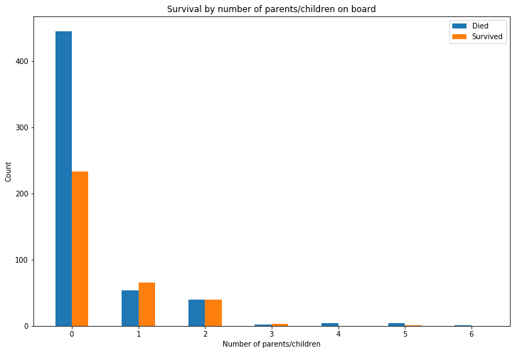

# Titanic Dataset
A classification task, predict whether or not passengers in the test set survived. This task is also an ongoing competition on the data science competition website Kaggle, so after making a prediction results can be submitted to the leaderboard.

### EDA and data cleaning
[Initial EDA](#eda)

[Data Visualisation](#visual)
### Models
[Initial model](#initial)

[Hyperparameter tuning](#tuning)
### Conclusion
[Conclusion and next steps](#conclusion)

<a id="eda"></a>

## Initial Exploratory Data Analysis


```python
import pandas as pd
train = pd.read_csv('train.csv')
train.head()
```


<div>
<style scoped>
    .dataframe tbody tr th:only-of-type {
        vertical-align: middle;
    }

    .dataframe tbody tr th {
        vertical-align: top;
    }

    .dataframe thead th {
        text-align: right;
    }
</style>
<table border="1" class="dataframe">
  <thead>
    <tr style="text-align: right;">
      <th></th>
      <th>PassengerId</th>
      <th>Survived</th>
      <th>Pclass</th>
      <th>Name</th>
      <th>Sex</th>
      <th>Age</th>
      <th>SibSp</th>
      <th>Parch</th>
      <th>Ticket</th>
      <th>Fare</th>
      <th>Cabin</th>
      <th>Embarked</th>
    </tr>
  </thead>
  <tbody>
    <tr>
      <th>0</th>
      <td>1</td>
      <td>0</td>
      <td>3</td>
      <td>Braund, Mr. Owen Harris</td>
      <td>male</td>
      <td>22.0</td>
      <td>1</td>
      <td>0</td>
      <td>A/5 21171</td>
      <td>7.2500</td>
      <td>NaN</td>
      <td>S</td>
    </tr>
    <tr>
      <th>1</th>
      <td>2</td>
      <td>1</td>
      <td>1</td>
      <td>Cumings, Mrs. John Bradley (Florence Briggs Th...</td>
      <td>female</td>
      <td>38.0</td>
      <td>1</td>
      <td>0</td>
      <td>PC 17599</td>
      <td>71.2833</td>
      <td>C85</td>
      <td>C</td>
    </tr>
    <tr>
      <th>2</th>
      <td>3</td>
      <td>1</td>
      <td>3</td>
      <td>Heikkinen, Miss. Laina</td>
      <td>female</td>
      <td>26.0</td>
      <td>0</td>
      <td>0</td>
      <td>STON/O2. 3101282</td>
      <td>7.9250</td>
      <td>NaN</td>
      <td>S</td>
    </tr>
    <tr>
      <th>3</th>
      <td>4</td>
      <td>1</td>
      <td>1</td>
      <td>Futrelle, Mrs. Jacques Heath (Lily May Peel)</td>
      <td>female</td>
      <td>35.0</td>
      <td>1</td>
      <td>0</td>
      <td>113803</td>
      <td>53.1000</td>
      <td>C123</td>
      <td>S</td>
    </tr>
    <tr>
      <th>4</th>
      <td>5</td>
      <td>0</td>
      <td>3</td>
      <td>Allen, Mr. William Henry</td>
      <td>male</td>
      <td>35.0</td>
      <td>0</td>
      <td>0</td>
      <td>373450</td>
      <td>8.0500</td>
      <td>NaN</td>
      <td>S</td>
    </tr>
  </tbody>
</table>
</div>


```python
test = pd.read_csv('test.csv')
test.head()
```


<div>
<style scoped>
    .dataframe tbody tr th:only-of-type {
        vertical-align: middle;
    }

    .dataframe tbody tr th {
        vertical-align: top;
    }

    .dataframe thead th {
        text-align: right;
    }
</style>
<table border="1" class="dataframe">
  <thead>
    <tr style="text-align: right;">
      <th></th>
      <th>PassengerId</th>
      <th>Pclass</th>
      <th>Name</th>
      <th>Sex</th>
      <th>Age</th>
      <th>SibSp</th>
      <th>Parch</th>
      <th>Ticket</th>
      <th>Fare</th>
      <th>Cabin</th>
      <th>Embarked</th>
    </tr>
  </thead>
  <tbody>
    <tr>
      <th>0</th>
      <td>892</td>
      <td>3</td>
      <td>Kelly, Mr. James</td>
      <td>male</td>
      <td>34.5</td>
      <td>0</td>
      <td>0</td>
      <td>330911</td>
      <td>7.8292</td>
      <td>NaN</td>
      <td>Q</td>
    </tr>
    <tr>
      <th>1</th>
      <td>893</td>
      <td>3</td>
      <td>Wilkes, Mrs. James (Ellen Needs)</td>
      <td>female</td>
      <td>47.0</td>
      <td>1</td>
      <td>0</td>
      <td>363272</td>
      <td>7.0000</td>
      <td>NaN</td>
      <td>S</td>
    </tr>
    <tr>
      <th>2</th>
      <td>894</td>
      <td>2</td>
      <td>Myles, Mr. Thomas Francis</td>
      <td>male</td>
      <td>62.0</td>
      <td>0</td>
      <td>0</td>
      <td>240276</td>
      <td>9.6875</td>
      <td>NaN</td>
      <td>Q</td>
    </tr>
    <tr>
      <th>3</th>
      <td>895</td>
      <td>3</td>
      <td>Wirz, Mr. Albert</td>
      <td>male</td>
      <td>27.0</td>
      <td>0</td>
      <td>0</td>
      <td>315154</td>
      <td>8.6625</td>
      <td>NaN</td>
      <td>S</td>
    </tr>
    <tr>
      <th>4</th>
      <td>896</td>
      <td>3</td>
      <td>Hirvonen, Mrs. Alexander (Helga E Lindqvist)</td>
      <td>female</td>
      <td>22.0</td>
      <td>1</td>
      <td>1</td>
      <td>3101298</td>
      <td>12.2875</td>
      <td>NaN</td>
      <td>S</td>
    </tr>
  </tbody>
</table>
</div>


The train and test set have identical features, the target column only being present in the training data.


```python
train.info()
```

    <class 'pandas.core.frame.DataFrame'>
    RangeIndex: 891 entries, 0 to 890
    Data columns (total 12 columns):
    PassengerId    891 non-null int64
    Survived       891 non-null int64
    Pclass         891 non-null int64
    Name           891 non-null object
    Sex            891 non-null object
    Age            714 non-null float64
    SibSp          891 non-null int64
    Parch          891 non-null int64
    Ticket         891 non-null object
    Fare           891 non-null float64
    Cabin          204 non-null object
    Embarked       889 non-null object
    dtypes: float64(2), int64(5), object(5)
    memory usage: 83.6+ KB


```python
test.info()
```

    <class 'pandas.core.frame.DataFrame'>
    RangeIndex: 418 entries, 0 to 417
    Data columns (total 11 columns):
    PassengerId    418 non-null int64
    Pclass         418 non-null int64
    Name           418 non-null object
    Sex            418 non-null object
    Age            332 non-null float64
    SibSp          418 non-null int64
    Parch          418 non-null int64
    Ticket         418 non-null object
    Fare           417 non-null float64
    Cabin          91 non-null object
    Embarked       418 non-null object
    dtypes: float64(2), int64(4), object(5)
    memory usage: 36.0+ KB


891 entries in the training set, with 418 in the test set.


```python
train.isnull().sum()
```


    PassengerId      0
    Survived         0
    Pclass           0
    Name             0
    Sex              0
    Age            177
    SibSp            0
    Parch            0
    Ticket           0
    Fare             0
    Cabin          687
    Embarked         2
    dtype: int64


```python
test.isnull().sum()
```


    PassengerId      0
    Pclass           0
    Name             0
    Sex              0
    Age             86
    SibSp            0
    Parch            0
    Ticket           0
    Fare             1
    Cabin          327
    Embarked         0
    dtype: int64


```python
print('Age : %d  percent missing values in the training set' % (train['Age'].isna().sum()*100/len(train)))
print('Cabin : %d percent missing values in the training set' % (train['Cabin'].isna().sum()*100/len(train)))
```

    Age : 19  percent missing values in the training set
    Cabin : 77 percent missing values in the training set


```python
train.Ticket.value_counts()[:10]
```


    CA. 2343        7
    347082          7
    1601            7
    CA 2144         6
    347088          6
    3101295         6
    S.O.C. 14879    5
    382652          5
    349909          4
    19950           4
    Name: Ticket, dtype: int64


```python
train.Cabin.value_counts()[:10]
```


    C23 C25 C27    4
    B96 B98        4
    G6             4
    C22 C26        3
    F2             3
    E101           3
    D              3
    F33            3
    E24            2
    F G73          2
    Name: Cabin, dtype: int64


```python
train.Embarked.value_counts()[:10]
```


    S    644
    C    168
    Q     77
    Name: Embarked, dtype: int64


```python
train.Pclass.value_counts()
```


    3    491
    1    216
    2    184
    Name: Pclass, dtype: int64


Ticket and Cabin are questionable features, ticket seems to be a generic alpha numeric value and cabin has over 70% of its values missing, without knowing information about the location of cabins I will discard both of these features.

<a id="visual"></a>

### Data visualisation
Visualising as much as possible can give us insights into our dataset and it's features.


```python
%matplotlib inline
import matplotlib.pyplot as plt
import numpy as np
survivors = train[train['Survived']==1]
not_survivors = train[train['Survived']==0]
survived_class = survivors['Pclass'].value_counts().sort_index()
died_class = not_survivors['Pclass'].value_counts().sort_index()
classes = survived_class.index

fig,ax = plt.subplots(figsize=(12,8))
bar_width = 0.35
bar0 = ax.bar(classes,died_class,bar_width,label='Died')
bar1 = ax.bar(classes+bar_width,survived_class,bar_width,label='Survived')
ax.set_title('Survivals by passenger class')
ax.set_xlabel('Passenger Class')
ax.set_xticklabels(classes)
ax.set_xticks(classes + bar_width / 2)
ax.set_ylabel('Count')
ax.legend()
plt.show()
```


Survival rates are significantly worse for those in third class, with first class having the best chances.


```python
survived = survivors['Sex'].value_counts().sort_index()
died = not_survivors['Sex'].value_counts().sort_index()

fig,ax = plt.subplots(figsize=(12,8))
bar_width = 0.35
index = pd.Index([1,2])
bar0 = ax.bar(index,died,bar_width,label='Died')
bar1 = ax.bar(index+bar_width,survived,bar_width,label='Survived')
ax.set_title('Survival by sex')
ax.set_xlabel('Sex')
ax.set_xticklabels(survived.index)
ax.set_xticks(index + bar_width / 2)
ax.set_ylabel('Count')
ax.legend()
```


    <matplotlib.legend.Legend at 0x7fdd33ec82e8>


Being female gave you a considerably better chance of survivng.


```python
import seaborn as sns
ax = plt.figure(figsize=(12,8))
ax = sns.swarmplot(x='Survived',y='Age',data=train)
ax.set_title('Suvival by Age')
ax.set_xticklabels(['Died','Survived'])
ax.set_xlabel('')
```


    Text(0.5,0,'')


Children were more likely to survive and the over 70s were very unlikely to make it. Young men look to have the worst survival rate.


```python
survived_class = survivors['Embarked'].value_counts().sort_index()
died_class = not_survivors['Embarked'].value_counts().sort_index()
index = pd.Index([1,2,3])

fig,ax = plt.subplots(figsize=(12,8))
bar_width = 0.35
bar0 = ax.bar(index,died_class,bar_width,label='Died')
bar1 = ax.bar(index+bar_width,survived_class,bar_width,label='Survived')
ax.set_title('Survivals by port of embarkation')
ax.set_xlabel('Port of embarkation')
ax.set_xticklabels(survived_class.index)
ax.set_xticks(index + bar_width / 2)
ax.set_ylabel('Count')
ax.legend()
plt.show()
```


Passengers embarking at port 'C' have the best survival rate of the training data.


```python
s_sib = survivors['SibSp'].value_counts().sort_index()
d_sib = not_survivors['SibSp'].value_counts().sort_index()
s_sib = s_sib.reindex(d_sib.index).fillna(0.0)
fig,ax = plt.subplots(figsize=(12,8))
index = s_sib.index
bar_width = 0.25
bar0 = ax.bar(index,d_sib,bar_width,label='Died')
bar1 = ax.bar(index+bar_width,s_sib,bar_width,label='Survived')
ax.set_title('Survival by number of sibling/spouse on board')
ax.set_xlabel('Number of sibling/spouse')
ax.set_xticks(index + bar_width / 2)
ax.set_xticklabels(s_sib.index)
ax.set_ylabel('Count')
ax.legend()
```


    <matplotlib.legend.Legend at 0x7fdd2b3e1588>


```python
sibsp = train['SibSp'].value_counts()
sibsp_survival = survivors['SibSp'].value_counts()
survival_pct_by_sibling = sibsp_survival / sibsp * 100

plt.bar(survival_pct_by_sibling.index,survival_pct_by_sibling)
plt.title('Survival % by number of sibling/spouse on board')
plt.xlabel('Number of sibling/spouse on board')
plt.ylabel('Survival %')
```


    Text(0,0.5,'Survival %')


```python
s_parch = survivors['Parch'].value_counts().sort_index()
d_parch = not_survivors['Parch'].value_counts().sort_index()
s_parch = s_parch.reindex(d_parch.index).fillna(0.0)

fig,ax = plt.subplots(figsize=(12,8))
index = s_parch.index
bar_width = 0.25
bar0 = ax.bar(index,d_parch,bar_width,label='Died')
bar1 = ax.bar(index+bar_width,s_parch,bar_width,label='Survived')
ax.set_title('Survival by number of parents/children on board')
ax.set_xlabel('Number of parents/children')
ax.set_xticks(index + bar_width / 2)
ax.set_xticklabels(s_parch.index)
ax.set_ylabel('Count')
ax.legend()
```


    <matplotlib.legend.Legend at 0x7fdd28ff3160>





```python
train['par_ch'] = np.where(train['Parch']==0,0,1)

survivors = train.loc[train['Survived']==1]
not_survivors = train.loc[train['Survived']==0]
d_parch = not_survivors['par_ch'].value_counts().sort_index()
s_parch = survivors['par_ch'].value_counts().sort_index()

fig, ax = plt.subplots(figsize=(12,8))
index = pd.Index([1,2])
bar_width = 0.4

bar0 = ax.bar(index,d_parch,bar_width,label='Died')
bar1 = ax.bar(index+bar_width,s_parch,bar_width,label='Survived')
ax.set_title('Survival by having parents/children onboard')
ax.set_xlabel('')
ax.set_xticks(index + bar_width / 2)
ax.set_xticklabels(['No parents/children','One or more'])
ax.legend()
```


    <matplotlib.legend.Legend at 0x7fdd2b42b4e0>


Having a relative or spouse on board greatly improved your chances of survival


```python
ax = plt.figure(figsize=(12,8))
ax = sns.boxplot(x = 'Survived', y = 'Fare', data = train)
ax.set_title('Survival by fare')
ax.set_xticklabels(['Died','Survived'])
ax.set_xlabel('')
```


    Text(0.5,0,'')


Higher paying passengers were more likely to survive, easily inferred from the passenger class information earlier.


```python
plt.figure(figsize=(12,8))
ax = sns.boxplot(x = 'Pclass', y = 'Fare', data = train)
ax.set_title('Fare paid for each Pclass')
```


    Text(0.5,1,'Fare paid for each Pclass')


```python
cols = ['Survived','Pclass','Sex','Age','SibSp','Parch','Fare']
corr = train[cols].corr()
corr
```


<div>
<style scoped>
    .dataframe tbody tr th:only-of-type {
        vertical-align: middle;
    }

    .dataframe tbody tr th {
        vertical-align: top;
    }

    .dataframe thead th {
        text-align: right;
    }
</style>
<table border="1" class="dataframe">
  <thead>
    <tr style="text-align: right;">
      <th></th>
      <th>Survived</th>
      <th>Pclass</th>
      <th>Age</th>
      <th>SibSp</th>
      <th>Parch</th>
      <th>Fare</th>
    </tr>
  </thead>
  <tbody>
    <tr>
      <th>Survived</th>
      <td>1.000000</td>
      <td>-0.338481</td>
      <td>-0.077221</td>
      <td>-0.035322</td>
      <td>0.081629</td>
      <td>0.257307</td>
    </tr>
    <tr>
      <th>Pclass</th>
      <td>-0.338481</td>
      <td>1.000000</td>
      <td>-0.369226</td>
      <td>0.083081</td>
      <td>0.018443</td>
      <td>-0.549500</td>
    </tr>
    <tr>
      <th>Age</th>
      <td>-0.077221</td>
      <td>-0.369226</td>
      <td>1.000000</td>
      <td>-0.308247</td>
      <td>-0.189119</td>
      <td>0.096067</td>
    </tr>
    <tr>
      <th>SibSp</th>
      <td>-0.035322</td>
      <td>0.083081</td>
      <td>-0.308247</td>
      <td>1.000000</td>
      <td>0.414838</td>
      <td>0.159651</td>
    </tr>
    <tr>
      <th>Parch</th>
      <td>0.081629</td>
      <td>0.018443</td>
      <td>-0.189119</td>
      <td>0.414838</td>
      <td>1.000000</td>
      <td>0.216225</td>
    </tr>
    <tr>
      <th>Fare</th>
      <td>0.257307</td>
      <td>-0.549500</td>
      <td>0.096067</td>
      <td>0.159651</td>
      <td>0.216225</td>
      <td>1.000000</td>
    </tr>
  </tbody>
</table>
</div>


None of the columns have high collinearity, while not being independent variables they may all be important in the final model.

<a id="clean"></a>

## Data Cleaning
### Missing values
Embarked has two missing values, these can be filled with the most frequent value 'S' as we have no other information to go on.
Fare has one missing value in the test set which can be imputed with the median.

The age column has a lot of null entries, as we do not wish to discard the column we can pick from a number of methods to impute these missing values.

1. Impute with 0.0 : Not applicable in this dataset
2. Impute with the mean or median : A common method for values that are known to not be 0, however it risks skewing the dataset.
3. Custom imputation : Design a different method for imputing the missing values.

Visualising the distribution of ages will give us an insight into which method may be appropriate


```python
plt.figure(figsize=(12,8))
plt.title('Age of passengers')
plt.xlabel('Age')
plt.ylabel('Count')
train['Age'].hist(bins=30)
```


    <matplotlib.axes._subplots.AxesSubplot at 0x7fdd33caebe0>


### Mean and median imputation


```python
age_mean = train['Age'].mean()
age_median = train['Age'].median()
print('Mean age : ', age_mean, ' Median age : ',age_median)
```

    Mean age :  29.69911764705882  Median age :  28.0


```python
mean_imp_age = train['Age'].fillna(age_mean)
median_imp_age = train['Age'].fillna(age_median)

plt.figure(figsize=(12,8))
ax1 = plt.subplot(1,2,1)
ax1 = mean_imp_age.hist(bins=30)
plt.title('Mean imputation')
plt.xlabel('Age')

ax2 = plt.subplot(1,2,2)
plt.title('Median imputation')
plt.xlabel('Age')
ax2 = median_imp_age.hist(bins=30)
```


This is clearly an unsatisfactory method that will skew the data.
### Custom imputation methods
There are again many custom methods that could be applied to fill in the missing values. Two of which are outlined below.

Stratified imputation : Imputing values into age brackets in the same ratio of the values present in the age brackets in the training set.
Name-based impuation : Using information available in the names of passengers, try and predict more accurately which age bracket the passenger falls in to.

Using a combination of the two methods above, we will look at the titles of passengers and whether they have parents or children ('Parch') on board.


```python
male_children = train.loc[train['Name'].str.contains('Master')]
male_children['Age'].describe()
```


    count    36.000000
    mean      4.574167
    std       3.619872
    min       0.420000
    25%       1.000000
    50%       3.500000
    75%       8.000000
    max      12.000000
    Name: Age, dtype: float64


With a max value of 12, males whose name contains 'Master' are all children.


```python
train.loc[train['Sex']=='male'].drop(male_children.index).sort_values(by='Age')[:5]
```


<div>
<style scoped>
    .dataframe tbody tr th:only-of-type {
        vertical-align: middle;
    }

    .dataframe tbody tr th {
        vertical-align: top;
    }

    .dataframe thead th {
        text-align: right;
    }
</style>
<table border="1" class="dataframe">
  <thead>
    <tr style="text-align: right;">
      <th></th>
      <th>PassengerId</th>
      <th>Survived</th>
      <th>Pclass</th>
      <th>Name</th>
      <th>Sex</th>
      <th>Age</th>
      <th>SibSp</th>
      <th>Parch</th>
      <th>Ticket</th>
      <th>Fare</th>
      <th>Cabin</th>
      <th>Embarked</th>
      <th>par_ch</th>
    </tr>
  </thead>
  <tbody>
    <tr>
      <th>731</th>
      <td>732</td>
      <td>0</td>
      <td>3</td>
      <td>Hassan, Mr. Houssein G N</td>
      <td>male</td>
      <td>11.0</td>
      <td>0</td>
      <td>0</td>
      <td>2699</td>
      <td>18.7875</td>
      <td>NaN</td>
      <td>C</td>
      <td>0</td>
    </tr>
    <tr>
      <th>683</th>
      <td>684</td>
      <td>0</td>
      <td>3</td>
      <td>Goodwin, Mr. Charles Edward</td>
      <td>male</td>
      <td>14.0</td>
      <td>5</td>
      <td>2</td>
      <td>CA 2144</td>
      <td>46.9000</td>
      <td>NaN</td>
      <td>S</td>
      <td>1</td>
    </tr>
    <tr>
      <th>686</th>
      <td>687</td>
      <td>0</td>
      <td>3</td>
      <td>Panula, Mr. Jaako Arnold</td>
      <td>male</td>
      <td>14.0</td>
      <td>4</td>
      <td>1</td>
      <td>3101295</td>
      <td>39.6875</td>
      <td>NaN</td>
      <td>S</td>
      <td>1</td>
    </tr>
    <tr>
      <th>352</th>
      <td>353</td>
      <td>0</td>
      <td>3</td>
      <td>Elias, Mr. Tannous</td>
      <td>male</td>
      <td>15.0</td>
      <td>1</td>
      <td>1</td>
      <td>2695</td>
      <td>7.2292</td>
      <td>NaN</td>
      <td>C</td>
      <td>1</td>
    </tr>
    <tr>
      <th>220</th>
      <td>221</td>
      <td>1</td>
      <td>3</td>
      <td>Sunderland, Mr. Victor Francis</td>
      <td>male</td>
      <td>16.0</td>
      <td>0</td>
      <td>0</td>
      <td>SOTON/OQ 392089</td>
      <td>8.0500</td>
      <td>NaN</td>
      <td>S</td>
      <td>0</td>
    </tr>
  </tbody>
</table>
</div>


By filtering for males and removing those with the title 'Master' we can see here that the youngest remaining male is 11 years old.


```python
male_children[male_children['Age'].isnull()]
```


<div>
<style scoped>
    .dataframe tbody tr th:only-of-type {
        vertical-align: middle;
    }

    .dataframe tbody tr th {
        vertical-align: top;
    }

    .dataframe thead th {
        text-align: right;
    }
</style>
<table border="1" class="dataframe">
  <thead>
    <tr style="text-align: right;">
      <th></th>
      <th>PassengerId</th>
      <th>Survived</th>
      <th>Pclass</th>
      <th>Name</th>
      <th>Sex</th>
      <th>Age</th>
      <th>SibSp</th>
      <th>Parch</th>
      <th>Ticket</th>
      <th>Fare</th>
      <th>Cabin</th>
      <th>Embarked</th>
      <th>par_ch</th>
    </tr>
  </thead>
  <tbody>
    <tr>
      <th>65</th>
      <td>66</td>
      <td>1</td>
      <td>3</td>
      <td>Moubarek, Master. Gerios</td>
      <td>male</td>
      <td>NaN</td>
      <td>1</td>
      <td>1</td>
      <td>2661</td>
      <td>15.2458</td>
      <td>NaN</td>
      <td>C</td>
      <td>1</td>
    </tr>
    <tr>
      <th>159</th>
      <td>160</td>
      <td>0</td>
      <td>3</td>
      <td>Sage, Master. Thomas Henry</td>
      <td>male</td>
      <td>NaN</td>
      <td>8</td>
      <td>2</td>
      <td>CA. 2343</td>
      <td>69.5500</td>
      <td>NaN</td>
      <td>S</td>
      <td>1</td>
    </tr>
    <tr>
      <th>176</th>
      <td>177</td>
      <td>0</td>
      <td>3</td>
      <td>Lefebre, Master. Henry Forbes</td>
      <td>male</td>
      <td>NaN</td>
      <td>3</td>
      <td>1</td>
      <td>4133</td>
      <td>25.4667</td>
      <td>NaN</td>
      <td>S</td>
      <td>1</td>
    </tr>
    <tr>
      <th>709</th>
      <td>710</td>
      <td>1</td>
      <td>3</td>
      <td>Moubarek, Master. Halim Gonios ("William George")</td>
      <td>male</td>
      <td>NaN</td>
      <td>1</td>
      <td>1</td>
      <td>2661</td>
      <td>15.2458</td>
      <td>NaN</td>
      <td>C</td>
      <td>1</td>
    </tr>
  </tbody>
</table>
</div>


These four 'Master's with missing values for age were also travelling with at least one 'Parch', presumably a parent in these cases. We can therefore be confident of these four passengers being 12 or under. 

A similar inference can be made for females with the title 'Mrs', missing age values here will indicate these passengers not being children. Those females with the title 'Miss' are far more likely to have parents than children when having 0 in the 'Parch' column. We can confirm this hypothesis with a simple visulatisaton.


```python
mrs = train['Name'].str.contains('Mrs.')
miss = train['Name'].str.contains('Miss.')
parch = train['Parch']>0
no_parch = train['Parch']==0

fig,axes = plt.subplots(figsize=(12,7))

ax = sns.distplot(train[mrs]['Age'].dropna(),axlabel='Age',label='"Mrs"',kde=False,bins=20)
ax.set_title('Comparison of ages with the titles "Mrs" and "Miss"')
ax = sns.distplot(train[miss]['Age'].dropna(),axlabel='',label="Miss",kde=False,bins=20)
ax.set_yticks([0,5,10,15,20])
plt.legend()

```


    <matplotlib.legend.Legend at 0x7fdd28e3ee80>


```python
fig,axes = plt.subplots(figsize=(12,7))

ax1 = sns.distplot(train[miss & parch]['Age'].dropna(),axlabel='Age',label='"Miss with parch"',kde=False,bins=20)
ax1 = sns.distplot(train[miss & no_parch]['Age'].dropna(),axlabel='',label='"Miss without parch"',kde=False,bins=20)
ax1.set_title('Comparison of ages of "Miss" with and without "parch onboard')
plt.legend()
```


    <matplotlib.legend.Legend at 0x7fdd28d50748>


While by no means concrete, males with the title 'Master' will be children, males with the title 'Mr' are 11 or over. Females with the title 'Mrs' can be assumed to be 14 or older and females with the title 'Miss' will be on average much younger if travelling with at least one 'Parch'.

This will give us a more accurate way of imputing the ages than just assigning an age on a simple stratified basis.


```python
from sklearn.base import TransformerMixin

class Age_Imputer(TransformerMixin):
    def __init__(self):
        """
        Imputes ages of passengers in the Titanic, values to be imputed will be dependant 
        on passenger titles and the presence of parents or children on board
        """
        pass
    def fit(self, X, y=None):
        return self
    def transform(self, X, y=None):
        def value_imp(passengers):
            """
            Imputes an age, based on a weighted random choice derived from the non
            null entries in the subsets of the dataset.
            """
            passengers=passengers.copy()
            # Create 3 year age bins
            bins = np.arange(0,passengers['Age'].max()+3,step=3)
            # Assign each passenger an age bin
            passengers['age_bins'] = pd.cut(passengers['Age'],bins=bins,labels=bins[:-1]+1.5)
            # Count totals of age bins
            count = passengers.groupby('age_bins')['age_bins'].count()
            # Assign each age bin a weight
            weights = count/len(passengers['Age'].dropna())
            null = passengers['Age'].isna()
            # For each missing value, give the passenger an age from the age bins available
            passengers.loc[passengers['Age'].isna(),'Age']=np.random.RandomState(seed=42).choice(weights.index,
                           p=weights.values,size=len(passengers[null]))
            return passengers
        master = X.loc[X['Name'].str.contains('Master')]
        mrs = X.loc[X['Name'].str.contains('Mrs')]
        miss = X.loc[X['Name'].str.contains('Miss')]
        no_parch = X.loc[X['Parch']==0]
        parch = X.loc[X['Parch']!=0]
        miss_no_parch = miss.drop([x for x in miss.index if x in parch.index])
        miss_parch = miss.drop([x for x in miss.index if x in no_parch.index])
        remaining_mr = X.loc[X['Name'].str.contains('Mr. ')]
        # Imputing 'Mrs' first, as in cases where passengers have the titles
        # 'Miss' and 'Mrs', they are married so will be in the older category
        name_cats = [master,mrs,miss_no_parch,miss_parch,remaining_mr]
        for name in name_cats:
            X.loc[name.index] = value_imp(name)
        return X
```

As an example, I will impute the 'Mrs' values and compare mean imputation and my custom imputation.


```python
def value_imp(passengers):
            """
            Imputes an age, based on a weighted random choice derived from the non
            null entries in the subsets of the dataset.
            """
            passengers = passengers.copy()
            bins = np.arange(0,passengers['Age'].max()+3,step=3)
            passengers['age_bins'] = pd.cut(passengers['Age'],bins=bins,labels=bins[:-1]+1.5)
            count = passengers.groupby('age_bins')['age_bins'].count()
            weights = count/len(passengers['Age'].dropna())
            null = passengers['Age'].isna()
            passengers.loc[passengers['Age'].isna(),'Age']=np.random.RandomState(seed=42).choice(weights.index,
                           p=weights.values,size=len(passengers[null]))
            return passengers
```


```python
train2 = train.copy()
mrs = train2.loc[train2['Name'].str.contains('Mrs.')]
train2.loc[mrs.index] = value_imp(mrs)
```


```python
fig,axes = plt.subplots(figsize = (12,7))

ax = sns.distplot(train2.loc[mrs.index]['Age'],label='Custom Imputation',kde=False,bins=20)
ax = sns.distplot(train.loc[mrs.index]['Age'].fillna(value=mrs['Age'].mean()),
                  label='Mean Imputation',kde=False,bins=20
                 )
ax.set_title('Comparison of custom and mean imputation')
plt.legend()
```


    <matplotlib.legend.Legend at 0x7fdd287cf748>


```python
train3 = train.copy()
imp = Age_Imputer()
imp.fit_transform(train3)
fig,axes = plt.subplots(figsize = (12,7))

ax = sns.distplot(train.loc[mrs.index]['Age'].dropna(),label='No imputation',kde=False,bins=20)
ax = sns.distplot(train3.loc[mrs.index]['Age'],label='Full custom imputation',kde=False,bins=20)
ax.set_title('Comparison of full custom imputation and no imputation')
plt.legend()
```


    <matplotlib.legend.Legend at 0x7fdd2871e048>


This method gives both a stratified imputation and by utilising some simple logic of titles of the era it has allowed us to more accurately predict the ages of those passengers with missing values.

<a id="model"></a>

### Initial modelling
We will first run a selection of classifiers on the training data with their default values, then choosing the most promising to pursue further with hyperparameter tuning.
#### Pipeline
A pipeline is not an essential piece of a project, however it allows easy access to add or remove a feature or tweak a hyperparameter and quickly be able to reproduce results. It will also allow us to implement GridSearchCV and RandomizedSearchCV to automatically test out many different hyperparameters, imputation methods or features. It would also allow quick transformation of any additional training data added to the dataset.

Given the different scales of numeric values, we will use a standard scaler on all numeric columns. We will encode all categorical labels 


```python
from sklearn.pipeline import Pipeline
from sklearn.preprocessing import StandardScaler
from sklearn.preprocessing import OneHotEncoder
from sklearn.pipeline import FeatureUnion
from sklearn.preprocessing import Imputer
from sklearn.preprocessing import LabelEncoder

class MultiColumnLabelEncoder(TransformerMixin):
    def __init__(self,columns = None):
        self.columns = columns 

    def fit(self,X,y=None):
        return self

    def transform(self,X):
        '''
        Transforms columns of X specified in self.columns using
        LabelEncoder(). If no columns specified, transforms all
        columns in X.
        '''
        output = X.copy()
        if self.columns is not None:
            for col in self.columns:
                output[col] = LabelEncoder().fit_transform(output[col])
        else:
            for colname,col in output.iteritems():
                output[colname] = LabelEncoder().fit_transform(col)
        return output
    
class DataFrameSelector(TransformerMixin):
    def __init__(self,attribute_names):
        self.attribute_names = attribute_names
    def fit(self, X, y=None):
        return self
    def transform(self, X, y=None):
        return X[self.attribute_names].values

class ValueImputer(TransformerMixin):
    """
    Imputes a fixed value
    """
    def __init__(self,attribute_names):
        self.attribute_names = attribute_names
    def fit(self, X, y=None):
        return self
    def transform(self, X, y=None):
        X[self.attribute_names] = X[self.attribute_names].fillna('S')
        return X[self.attribute_names]

numerical_atts = ['Age','SibSp','Parch','Fare']
cat_atts = ['Sex','Pclass','Embarked']

num_pipeline = Pipeline([
    ('imputer', Age_Imputer()),
    ('selector', DataFrameSelector(numerical_atts)),
    ('imp', Imputer(strategy='mean')),
    ('scaler', StandardScaler()),
])

cat_pipeline = Pipeline([
    ('cat_imputer', ValueImputer(cat_atts)),
    ('encoder', MultiColumnLabelEncoder(columns=cat_atts)),
    ('selector', DataFrameSelector(cat_atts)),
])


full_pipeline = FeatureUnion(transformer_list=[
    ('num_pipeline', num_pipeline),
    ('cat_pipeline', cat_pipeline),
])

train_data_prepared = full_pipeline.fit_transform(train)
train_labels = train['Survived']

feature_list = numerical_atts + cat_atts
```


```python
train_data_prepared.shape
```


    (891, 7)


```python
feature_list
```


    ['Age', 'SibSp', 'Parch', 'Fare', 'Sex', 'Pclass', 'Embarked']


Importing a selection of models, fitting to the train data and predicting the training labels, using the average score of a 3 fold cross validation to try and avoid overfitting to the training data.


```python
from sklearn.linear_model import RidgeClassifier
from sklearn.neighbors import KNeighborsClassifier
from sklearn.linear_model import SGDClassifier
from sklearn.tree import DecisionTreeClassifier
from sklearn.ensemble import RandomForestClassifier
from sklearn.neural_network import MLPClassifier
from sklearn.metrics import classification_report
from sklearn.cross_validation import cross_val_score

classifiers = [RidgeClassifier(),KNeighborsClassifier(),
              SGDClassifier(
                  max_iter=1000),DecisionTreeClassifier(),RandomForestClassifier(),
              MLPClassifier(max_iter=1000)]
names = ['Ridge','KNN','SGD','Decision Tree','Random Forest','MLP']

for name, classifier in zip(names,classifiers):
    classifier.fit(train_data_prepared,train_labels)
    print('Scores for ',name,' : ',cross_val_score(classifier,train_data_prepared,train_labels,cv=3).mean())
    

```

    /home/dave/anaconda3/lib/python3.6/site-packages/sklearn/cross_validation.py:41: DeprecationWarning: This module was deprecated in version 0.18 in favor of the model_selection module into which all the refactored classes and functions are moved. Also note that the interface of the new CV iterators are different from that of this module. This module will be removed in 0.20.
      "This module will be removed in 0.20.", DeprecationWarning)


    Scores for  Ridge  :  0.7822671156004489
    Scores for  KNN  :  0.7890011223344556
    Scores for  SGD  :  0.7923681257014591
    Scores for  Decision Tree  :  0.7586980920314254
    Scores for  Random Forest  :  0.8024691358024691
    Scores for  MLP  :  0.8170594837261503


<a id="tuning"></a>

### Hyperparameter tuning
The MLP classifier has performed the best on the training data so we will focus on that with some hyperparameter tuning.

RandomizedSearchCV lets you input a selection of hyperparameters, select a number of searches to make and will randomly select the models hyperparameters. This is a very good option if you are not sure where to start looking for hyperparameter values as it will cover a wide selection of values. Performing many iterations of fitting and predicting this way is however very computationally expensive with large datasets.


```python
from sklearn.model_selection import RandomizedSearchCV

mlp = RandomizedSearchCV(MLPClassifier(),cv=3,n_iter=20,param_distributions=(
    {'hidden_layer_sizes':[(100,),(200,),(500,),(1000,)],
    'activation' : ['identity', 'logistic', 'tanh', 'relu'],
    'solver' : ['lbfgs','sgd','adam'],
    'alpha' : np.linspace(0,0.001),
    'max_iter' : [200,500,1000,2000],
    }))
mlp.fit(train_data_prepared,train_labels)

```


    RandomizedSearchCV(cv=3, error_score='raise',
              estimator=MLPClassifier(activation='relu', alpha=0.0001, batch_size='auto', beta_1=0.9,
           beta_2=0.999, early_stopping=False, epsilon=1e-08,
           hidden_layer_sizes=(100,), learning_rate='constant',
           learning_rate_init=0.001, max_iter=200, momentum=0.9,
           nesterovs_momentum=True, power_t=0.5, random_state=None,
           shuffle=True, solver='adam', tol=0.0001, validation_fraction=0.1,
           verbose=False, warm_start=False),
              fit_params=None, iid=True, n_iter=20, n_jobs=1,
              param_distributions={'hidden_layer_sizes': [(100,), (200,), (500,), (1000,)], 'activation': ['identity', 'logistic', 'tanh', 'relu'], 'solver': ['lbfgs', 'sgd', 'adam'], 'alpha': array([0.00000e+00, 2.04082e-05, 4.08163e-05, 6.12245e-05, 8.16327e-05,
           1.02041e-04, 1.22449e-04, 1.42857e-04, 1.6...18367e-04, 9.38776e-04, 9.59184e-04, 9.79592e-04, 1.00000e-03]), 'max_iter': [200, 500, 1000, 2000]},
              pre_dispatch='2*n_jobs', random_state=None, refit=True,
              return_train_score='warn', scoring=None, verbose=0)


```python
print('Best score : {}'.format(mlp.best_score_))
mlp.best_params_

```

    Best score : 0.819304152637486


    {'activation': 'relu',
     'alpha': 0.00042857142857142855,
     'hidden_layer_sizes': (100,),
     'max_iter': 2000,
     'solver': 'adam'}


The best parameters returned by the search. These can now be used to make a prediction on the test set, the pipeline now making the job of transforming the test data a simple one.


```python
test_prepared = full_pipeline.fit_transform(test)
best_mlp = mlp.best_estimator_
predictions = best_mlp.predict(test_prepared)
predictions[:20]
```


    array([0, 1, 0, 0, 0, 0, 1, 0, 1, 0, 0, 0, 1, 0, 1, 1, 0, 0, 0, 1])


To submit the predictions to the kaggle leaderboard a csv must be created.


```python
submission = pd.DataFrame({'PassengerId':test['PassengerId'],'Survived':predictions})
submission.to_csv('submission.csv',index=False)
submission.head()
```


<div>
<style scoped>
    .dataframe tbody tr th:only-of-type {
        vertical-align: middle;
    }

    .dataframe tbody tr th {
        vertical-align: top;
    }

    .dataframe thead th {
        text-align: right;
    }
</style>
<table border="1" class="dataframe">
  <thead>
    <tr style="text-align: right;">
      <th></th>
      <th>PassengerId</th>
      <th>Survived</th>
    </tr>
  </thead>
  <tbody>
    <tr>
      <th>0</th>
      <td>892</td>
      <td>0</td>
    </tr>
    <tr>
      <th>1</th>
      <td>893</td>
      <td>1</td>
    </tr>
    <tr>
      <th>2</th>
      <td>894</td>
      <td>0</td>
    </tr>
    <tr>
      <th>3</th>
      <td>895</td>
      <td>0</td>
    </tr>
    <tr>
      <th>4</th>
      <td>896</td>
      <td>0</td>
    </tr>
  </tbody>
</table>
</div>


This result scored 0.77033 on the public leaderboard, nearly 80% of passengers correctly predicted.

<a id="conclusion"></a>

## Conclusion and next steps
To try and improve the model further there are several different avenues to explore.
#### Feature engineering
Adapting the available features or creating entirely new ones out of the current data. One idea would be to parse the titles out of the names as a new categorical feature.


```python
forest = RandomForestClassifier()
forest.fit(train_data_prepared,train_labels)
sorted(zip(forest.feature_importances_,feature_list),reverse=True)
```


    [(0.2938534661605394, 'Age'),
     (0.27808335491371483, 'Fare'),
     (0.23227073301245169, 'Sex'),
     (0.07646213961933193, 'Pclass'),
     (0.04568014748095272, 'Parch'),
     (0.044908146840692574, 'SibSp'),
     (0.028742011972316867, 'Embarked')]


Given information like this about feature importance we can choose to adapt the age column into categories or make a new feature that is a combination of exisiting ones such as Age/Fare. We could also onehotencode all categorical features to remove any chance of the model inferring relationships between the numbers currently assigned.
#### Hyperparameter tuning/model selection
Further fine tuning the existing model or trying different ones, new features may lead to improved performance of different models.
#### Error evaluation
Given access to the answers we could categorise the errors that the model made, did it give too many false positives for young women for example. Using this information both the model and input features can be adapted to improve the models accuracy.
